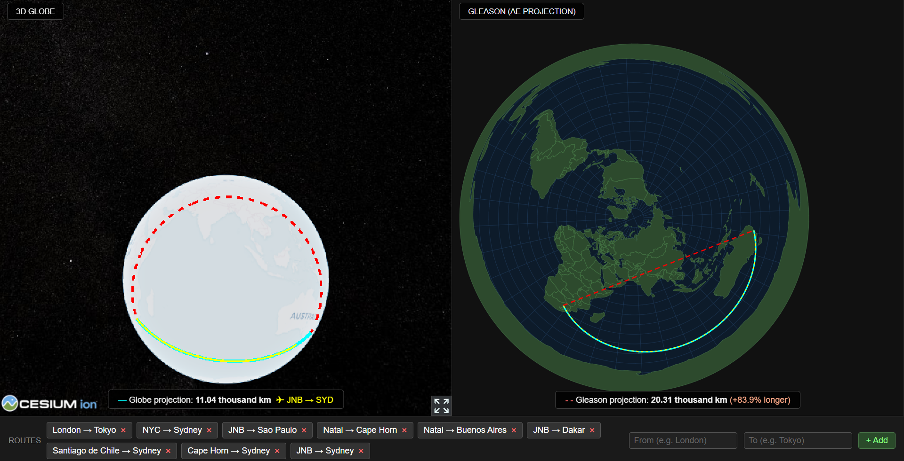

# Globe vs Gleason

An interactive browser experience that compares a 3D Cesium globe with a
Gleason azimuthal equal-area projection. The program lets you add and save
long-distance routes between cities, then view them on both the globe and
projection map.



## Contents

- `index.html` — main application page
- `screenshot.png` — example screenshot of the app
- `serve.py` — standalone live server runner
- `LICENSE` — GNU GPLv3 license

## Requirements

- Modern web browser (Chrome, Edge, Firefox, Safari)
- Internet access to load external libraries from CDN
- Python 3 installed for the standalone live server runner

## Run in live server mode

### Option 1: Use the standalone runner

From the project folder, run:

```sh
python serve.py
```

This starts a local server and opens `index.html` in your default browser.

If you need a different port:

```sh
python serve.py --port 9000
```

If you want to serve a different folder, use:

```sh
python serve.py --root path/to/folder
```

Then open:

```text
http://127.0.0.1:9000/index.html
```

### Option 2: Use Visual Studio Code Live Server

1. Open this workspace in VS Code.
2. Install the `Live Server` extension if you do not already have it.
3. Open `index.html`.
4. Click the `Go Live` button in the status bar or right-click the file and
   choose `Open with Live Server`.

## How to use the program

1. Open the app in a browser.
2. In the `From` and `To` text fields, enter two city names.
3. Click `+ Add` to create a named route.
4. The route is added to the panel and saved in local browser storage.
5. Click any saved route button to draw the route on the globe and
   Gleason projection.
6. Use the `×` button on a route to remove it from the list.

## Notes

- The app uses external CDN libraries, so a live server or local file server
  is required to avoid browser restrictions when loading the map data.
- Route data is stored in `localStorage`, so saved routes remain available
  after refreshing the page in the same browser.
- The Gleason projection display is interactive and allows map navigation.

## License

This project is licensed under the GNU General Public License v3. See
`LICENSE` for details.
